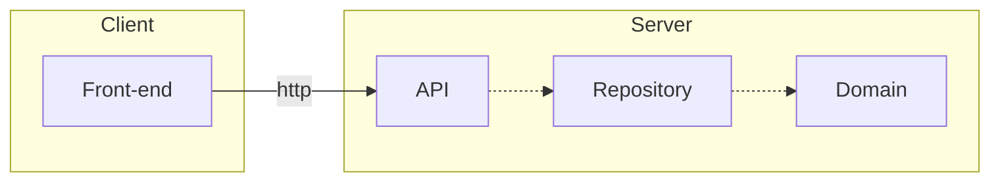

# Yakify - Yak Imperium

This repository contains the application for an imaginary webshop featuring yaks. Yaks give produce which can be ordered through the front-end. The app does not have a notion of time. A customer and shepherd can time travel between days to view stock and order at their desired day.

## Architecture

The application has a basic four-layer architecture: a front-end which uses web calls to talk to an opaque, stateless server. The server-side code consists of the remaining three layers:

- A service layer (API)
- An infrastructure layer (Repository)
- Technology-agnostic business logic (Domain)



## Requirements and running

The application is written in C# NET8 and React-Typescript. To run the application you need the following software installed:

- NET 8 SDK, I've used 8.0.101
- NodeJS, I've used 18.14.2
- npm, I've used 9.5.0

To start the application from the command line, run

```bash
# Working directory .
docker-compose up

# Working directory ./yakify.web
npm run start

# Working directory ./Yakify.Api
dotnet run
```

in three seperate terminals.

To run the back-end tests, run

```bash
dotnet test
```

from any C# test project. To run the integration tests, run

```bash
docker-compose -f docker-compose-integration-tests.yml up --detach

cd Yakify.IntegrationTests
dotnet test
```